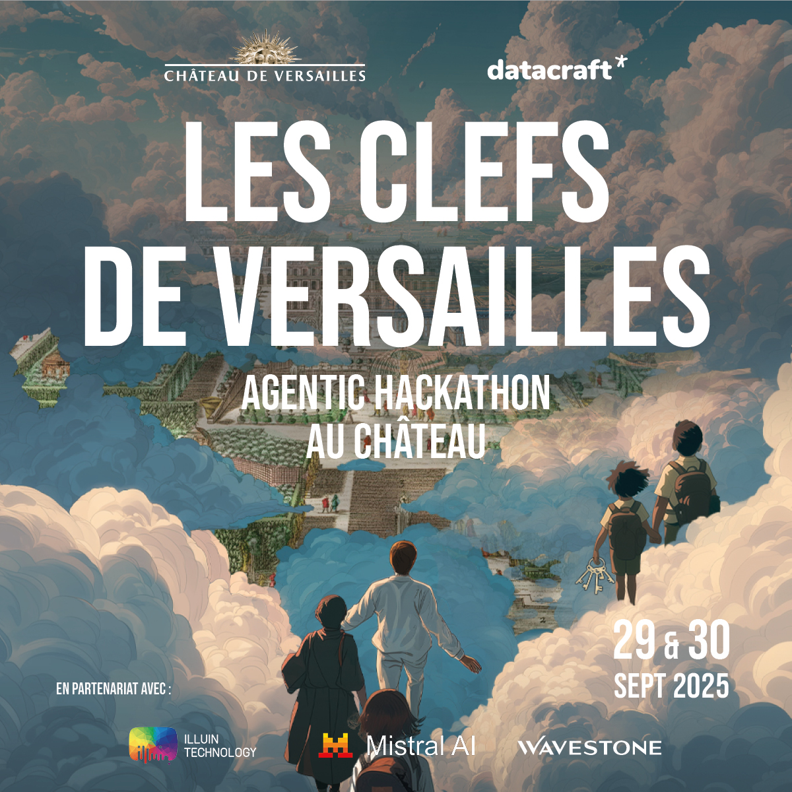

<p align="center">
  <!--  -->
  <!-- <br/> -->
  
</p>

# Hackathon Les Clefs de Versailles - 29-30/09/2025

[datacraft](https://www.datacraft.paris) et le Château de Versailles sont ravis de vous convier au Hackathon **Les Clefs de Versailles**, qui se tiendra les 29 et 30 Septembre 2025.


## Index
- [Objectifs du Hackathon](#objectifs-du-hackathon)
- [Livrables attendus](#livrables-attendus)
- [Règles de la compétition](#règles-de-la-compétition)
- [Critères d'évaluation](#critères-dévaluation)
- [Présentation du jeu de données](#présentation-du-jeu-de-données)
- [Activation des crédits Mistral par équipe](#activation-des-crédits-mistralai-par-équipe)
- [Configuration NGrok](#configuration-ngrok)

## Objectifs du Hackathon

Utiliser les dernières technologies d'IA agentique pour concevoir un chatbot capable de proposer le meilleur parcours de visite à l'utilisateur en fonction de ses envies, contraintes et aspirations. 

## Livrables attendus

#### 1. Repository GitHub

Un repository GitHub avec votre solution, ainsi qu'un ```README.md``` contenant *a minima*: 
- une brève description de votre architecture et des choix techniques retenus. 
- les instructions nécessaires pour installer et exécuter votre projet. 

#### 2. Route API - app 

ENDPOINT : http://your-domain.ngrok.app/ - GET

Voir détails dans la section `Critères d'évaluation - évaluation qualitative`.

#### 3. Route API - chat 

ENDPOINT : http://your-domain.ngrok.app/chat - POST

Voir détails dans la section `Critères d'évaluation - évaluation quantitative`.

--- 

> Retrouvez toutes les informations et instructions pour rendre accessible vos [enpoints via Ngrok dans la section dédiée.](#configuration-ngrok)


## Règles de la compétition

- Équipes de 4 personnes

## Critères d'évaluation 

L'évaluation est divisée en 3 parties :

<details><summary><b>Évaluation qualitative (25%)</b></summary>

#### Livrable : interface de chat ```http://your-ngrok-domain/```

  Cette évaluation a pour but de tester votre interface de chat ainsi que votre capacité à créer un outil intuitif et pertinent.

  Des représentants du Château auront 7 minutes pour tester votre solution, et attribuer une note sur 5 aux critères suivants : 
  - Intuitivité 
  - Réactivité 
  - Pertinence des questions du chatbot 
  - Pertinence de l'itinéraire proposé 
  - Originalité des fonctionnalités proposées 

  L’esthétique de l’interface ne sera que peu prise en compte. 

  Afin de simplifier l’évaluation et ne pas perdre de temps sur du déploiement, chaque équipe devra se présenter à l’évaluation avec un ordinateur AZERTY sur lequel tourne votre chat. Veillez à avoir suffisamment de batterie. 

  Vous devrez également lister les 3/4 fonctionnalités/options d’interface que vous jugez les meilleures sur une feuille A4, afin d’en informer l’examinateur et lui permettre de les tester. 

</details>

<details><summary><b>Évaluation quantitative (25%)</b></summary>

#### Livrable : route API ```http://your-ngrok-domain/chat```

Cette évaluation a pour but de tester la qualité et la précision des réponses et des itinéraires proposés par votre solution. 

25 requêtes de visiteurs seront envoyées à votre solution via une route API que vous devrez exposer à l’aide de Ngrok (voir documentation) , et les 25 réponses générées par votre code seront récoltées. 

Elles seront ensuite comparées automatiquement à des réponses idéales rédigées en étroite collaboration avec le château de Versailles. Ainsi, chaque réponse se verra attribuer une note et le total sera additionné. 

Votre chatbot doit être accessible via un endpoint REST unique /chat qui accepte les questions des visiteurs et retourne des conseils ciblés sur la visite de Versailles. Pour chaque requête d’évaluation, une requête POST sera envoyée à votre chatbot avec un payload JSON contenant un unique champ question du visiteur. Votre API doit renvoyer une answer contenant la réponse complète à la requête du visiteur.

Format de requête d’évaluation : ```{"question": "requête du visiteur"}```

Format de réponse attendu : ```{"answer": "réponse complète du chatbot"}```

Le Endpoint de votre groupe vous a été communiqué avec le token d'authentification Ngrok sur Discord. 

Endpoint appelé pour l’évaluation : https://your-ngrok-domain/chat

> ⚠️ Nous vous recommandons de prévoir une route API dédiée à l’évaluation qui répond à la requête en un unique message, car ce comportement peut être différent d’un chatbot conversationnel.

- Exemples de requêtes

Le dataset comprend 20 requêtes complexes de personas : 

> Marie maman seule — 42 ans, Lyon, 2 enfants (7 & 10), primo-visite, budget économique
  
  • REQ-01 — « On est à Paris avec deux enfants (7 et 10 ans), jamais venus à Versailles. On a une demi-journée un mercredi après-midi et un petit budget. On aimerait surtout être dehors. Que nous conseillez-vous et comment prendre les billets ? »
  
  Exemple d’éléments de réponse attendus : itinéraire suggéré, lieux à visiter (avec horaires), billets recommandés et prix, suggestions de visites adaptées aux familles, variations en fonctions des périodes de l’année + autres éléments indiqués dans la fiche "Astuces du Château". 

> Dido — 52 ans, Denver (USA), enfants de 13 et 19 ans, primo visite
 
  • REQ-02 — “We’re considering two days at Versailles over a weekend. How would you split the visit across both days (must-see highlights + great photo spots), and what tickets should we secure in advance?”

  Exemple d’éléments de réponse attendus : suggested itinerary, tickets + price, guided tour, family program, lunch options, photospots, hotels options.

> Et 5 requêtes générales, plus simples : 

• REQ-03 — « Je viens au Château la semaine prochaine, quel jour me conseille-tu de venir?» 

Les visites durent de 2h à 2 jours. 
</details>


<details><summary><b>Jury final (50%)</b></summary>

#### Livrable : Présentation du projet

Le jury évaluera votre travail sur la base d’une présentation de 7 minutes. 

Mettez davantage l’accent sur la technique, les choix d’architecture et de technologie.

**Il dispose de 5 critères d'évaluation et doit attribuer une note sur 5 pour chaque critère :**

- pertinence de la réponse à la problématique

  - Dans quelle mesure le projet répond-il clairement aux objectifs : générer un parcours de visite personnalisé pertinent et proposer une interface de chat complète et intuitive ?
  - Le système prend-il en compte différents paramètres extérieurs au dataset (météo, affluence, transports, etc.) ?

- Caractère innovant de la solution proposée : 
  - Le projet utilise-t-il des approches innovantes (workflows agentiques orginales, techniques de RAG innovantes, etc.) 
  - La solution se distingue-t-elle par son originalité ou sa capacité à aller au-delà des attentes ?

- Complexité technique : 
  - Le projet mobilise-t-il des techniques avancées (RAG, Agents, orchestration, optimisation, etc.)

- Pertinence des choix techniques : 
  - la stack technologique est-elle solide, éprouvée et maintenable ?
  - L’architecture est-elle propre, modulaire, maintenable ?

- Qualité de la présentation 
  - Le pitch est-il clair, structuré, et bien chronométré ?
  - L’équipe met-elle bien en valeur sa proposition et ses points forts ?

</details>

## Présentation du jeu de données

## Activation des crédits MistralAI par équipe

> Pour bénéficier des outils Mistral sans limitation, il est nécessaire de souscrire à l'option "Scale" et de renseigner un numéro de carte bancaire, indépendamment des crédits mis à disposition pour la compétition. 

Pour activer votre clé Mistral, rendez-vous sur https://admin.mistral.ai/organization/billing

- Souscrivez à l'option "Scale"

- Dans la section "Utiliser votre code cadeau", rentrez le code qui vous a été remis.

## Configuration NGrok 

  1. Installation 

```
brew install ngrok #macOS
# or 
curl -sSL https://ngrok-agent.s3.amazonaws.com/ngrok.asc \
  | sudo tee /etc/apt/trusted.gpg.d/ngrok.asc >/dev/null \
  && echo "deb https://ngrok-agent.s3.amazonaws.com buster main" \
  | sudo tee /etc/apt/sources.list.d/ngrok.list \
  && sudo apt update \
  && sudo apt install ngrok #Linux
```
Sur Windows, suivez les instructions présentes sur [cette page](https://download.ngrok.com/?tab=download)

  2. Configuration 

Un token d'identification Ngrok a été envoyé à tous les groupes dans le channel de votre équipe, ainsi qu'un domaine spécifique pour votre projet. 

Pour intégrer votre token d'authentification à votre configuration ngrok, veuillez exécuter la commande suivante : 

```
ngrok config add-authtoken <YOUR_AUTH_TOKEN>
```

  3. Éxécution

- lancez le serveur local de votre projet et exposez le sur le port de votre choix
- une fois votre serveur local lancé, vous pouvez exécuter la commande suivante pour exposer votre endpoint : 

```
ngrok http <YOUR LOCAL SERVER PORT> --domain <YOUR_TEAM_DOMAIN>
```
<p align="center">
  
  </p>
  <p align="center">
  2025 ·
  <a href="mailto:contact@datacraft.paris">contact@datacraft.paris</p>
</p>
